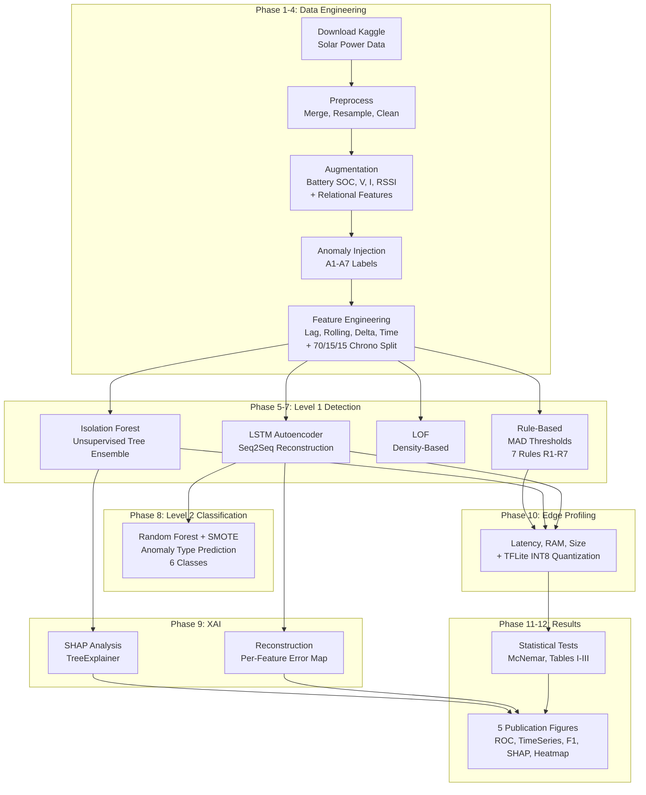

Berikut adalah penjelasan lengkap dan detail dari notebook `scio_anomaly_benchmark.ipynb`, yang merupakan orchestrator utama untuk seluruh pipeline eksperimen SCIO-Bench.

---

## 📖 Penjelasan Lengkap `scio_anomaly_benchmark.ipynb`

### Overview

Notebook ini adalah **reproducible wrapper** untuk seluruh pipeline eksperimen SCIO-Bench, sebuah framework benchmark untuk **anomaly detection** pada data telemetri IoT solar+batery off-grid. Pipeline terdiri dari **14 fase (0–13)** yang telah dimodularisasi ke dalam package Python di bawah `src/`.

**Penulis:** Karel Tsalasatir Riyan — Universitas Jenderal Soedirman — April 2026

---

### Cell 1: Setup Working Directory

```python
import os
if os.path.basename(os.getcwd()) == "notebooks":
    os.chdir("..")
print(f"Current working directory: {os.getcwd()}")
```

**Penjelasan:** Mengubah working directory ke root project (`SCIO-Bench/`) jika notebook dijalankan dari folder `notebooks/`. Ini memastikan semua path relatif ke modul `src/` dan folder `data/`/`outputs/` bekerja dengan benar.

---

### Cell 2: Phase 1–4 — Data Engineering Pipeline

```python
!python -m src.data.download
!python -m src.data.preprocess
!python -m src.data.augmentation
!python -m src.data.anomaly_injection
!python -m src.data.feature_engineering
```

**Penjelasan per sub-phase:**

#### Phase 1a: Download (`src/data/download.py`)
- Mengunduh dataset **Kaggle Solar Power Generation Data** (Ani Kannal, 2020) via Kaggle API
- Dataset berisi 2 pembangkit surya di India, 34 hari pengamatan
- 4 file CSV: `Plant_1_Generation_Data.csv`, `Plant_1_Weather_Sensor_Data.csv`, `Plant_2_Generation_Data.csv`, `Plant_2_Weather_Sensor_Data.csv`
- Kredensial Kaggle diambil dari environment variable `KAGGLE_KEY`/`KAGGLE_USERNAME` atau `~/.kaggle/kaggle.json`
- **Output:** `data/raw/*.csv`

#### Phase 1b: Preprocessing (`src/data/preprocess.py`)
- **Load & Merge:** Inner-join data generasi + data cuaca berdasarkan `DATE_TIME`
- **Resample:** Resampling ke interval **30 menit** (simulasi polling gateway IoT)
- **NaN/Inf Cleanup:**
  1. Replace ±Inf → NaN
  2. Forward-fill maksimal 2 tick consecutive
  3. Sisa NaN diisi dengan diurnal median (per jam) untuk hindari inkonsistensi fisik (irradiance siang hari vs malam)
  4. Fallback ke global median
- **Rename Columns:** Mapping dari nama Kaggle ke konvensi SCIO (contoh: `DC_POWER` → `mppt_w`, `IRRADIATION` → `irradiance`)
- **Derive Variables:** Konversi kW→W, clipping nilai negatif, derive `prod_wh` (energi per tick)
- **Output:** `data/processed/plant1_clean.csv`, `data/processed/plant2_clean.csv`

#### Phase 2: Augmentation (`src/data/augmentation.py`)
Menambahkan variabel sintetik yang mensimulasikan IoT sensor baterai dan komunikasi:

| Variabel | Deskripsi |
|---|---|
| `batt_pct` | State of Charge baterai (%) — model non-linear dengan tapering charge, degradasi cycle, noise sensor |
| `volt_v` | Tegangan bus (V) — derived dari kurva discharge LiFePO4 24V polynomial fit |
| `curr_a` | Arus (A) — `mppt_w / volt_v` (P = V × I) |
| `rssi` | Kekuatan sinyal (dBm) — distribusi normal N(-70, 15) |
| `protocol` | Protokol komunikasi: `lora` jika RSSI ≥ -80 dBm, `4g` jika di bawahnya |

**5 Fitur Relational (Physics-based, scale-invariant):**

| Fitur | Formula | Tujuan |
|---|---|---|
| `ratio_power_irr` | `mppt_w / (irradiance + ε)` | Proxy efisiensi panel |
| `ratio_volt_curr` | `volt_v / (curr_a + ε)` | Proxy impedansi — sensitif terhadap A7 FDI |
| `physics_residual` | `mppt_w - volt_v × curr_a` | Seharusnya ≈ 0 untuk data jujur; spike = indikasi FDI |
| `batt_delta` | `Δbatt_pct` per tick | Laju perubahan SOC |
| `prod_vs_batt` | `prod_wh - batt_delta × capacity/100` | Keseimbangan energi: yang diproduksi vs yang tersimpan |

**Output:** `data/processed/plant1_augmented.csv`, `data/processed/plant2_augmented.csv`

#### Phase 3: Anomaly Injection (`src/data/anomaly_injection.py`)
Menginjeksi **7 tipe anomali** ke dataset gabungan kedua plant:

| Kode | Tipe | Proporsi | Durasi | Deskripsi | Label `is_anomaly` |
|---|---|---|---|---|---|
| **A1** | Panel Degradation | 2% | 6 jam (12 tick) | Decay gradual 30-50% pada `mppt_w` | `True` |
| **A2** | Sudden Panel Drop | 1.5% | 1 jam (2-3 tick) | Drop instan 60-80% pada power dan voltage | `True` |
| **A3** | Battery Fault | 2% | 4 jam (8 tick) | Rapid SOC drop >5%/tick ATAU SOC stuck | `True` |
| **A4** | Sensor Drift | 1.5% | 3 jam (6 tick) | Offset persisten ±15% pada volt_v | `True` |
| **A5** | Device Offline | 2% | 2 jam (4-5 tick) | Last-value-held (simulasi NaN → sensor fill) | `True` |
| **A6** | Extended Low Irradiance | ~15% | 24 jam (48 tick) | **BUKAN ANOMALI!** — cuaca tropis berawan | **`False`** |
| **A7** | False Data Injection (Adversarial) | 1% | 1.5 jam (3 tick) | volt_v ↑10-20%, curr_a ↓30-50%, mppt_w tak berubah → P ≠ V×I | `True` |

**Design rules:**
- Seed `np.random.seed(42)` untuk reproducibilitas penuh
- Injeksi **tidak overlap** (satu tick hanya mendapat satu tipe anomali)
- Urutan injeksi: A6 dulu (klaim segmen besar), lalu A1–A5, terakhir A7
- A6 dilabeli `is_anomaly=False` — digunakan untuk evaluasi **FPR (False Positive Rate)**
- Setelah injeksi, **5 fitur relational dihitung ulang** agar `physics_residual` merefleksikan state yang sudah diinjeksi

**Output:** `outputs/dataset/scio_bench_dataset.csv` (~3.200 baris)

#### Phase 4: Feature Engineering & Splitting (`src/data/feature_engineering.py`)

**Fitur yang ditambahkan:**

| Kategori | Fitur | Detail |
|---|---|---|
| **Lag** | `mppt_w_lag1`, `mppt_w_lag2`, `volt_v_lag1`, `batt_pct_lag1`, `irradiance_lag1` | Nilai 1-2 tick sebelumnya, groupby per device_id |
| **Rolling (6h)** | `*_mean_6h`, `*_std_6h` untuk mppt_w, irradiance, batt_pct | Window=12 tick, `closed='left'` untuk hindari look-ahead leakage |
| **Delta** | `mppt_w_delta`, `volt_v_delta`, `batt_pct_delta`, `irradiance_delta` | First-order difference per device |
| **Time (cyclic)** | `hour_sin`, `hour_cos`, `minute_sin`, `minute_cos` | Encoding sin/cos untuk hindari diskontinuitas tengah malam |
| **Night mask** | `is_night` | 1 jika jam 18-05 dan irradiance=0; delta di-nol-kan saat malam |
| **Weather flag** | `is_low_irradiance_period` | Binary flag untuk periode A6 |

**Chronological Split (TANPA shuffle — mencegah data leakage):**
- **Train:** 70% pertama (berdasarkan timestamp)
- **Val:** 15% berikutnya
- **Test:** 15% terakhir

**Scaling:**
- `StandardScaler` di-fit **hanya pada train split**
- Transform train/val/test
- Scaler disimpan ke `outputs/dataset/scaler.pkl`

**Output:** `data/splits/{train,val,test}.csv`

---

### Cell 3: Phase 5–7 — Anomaly Detection (Level 1)

```python
!python -m src.models.rule_based
!python -m src.models.isolation_forest
!python -m src.models.lof
!python -m src.models.lstm_autoencoder
```

#### Phase 5: Method A — Rule-Based Threshold (`src/models/rule_based.py`)

**7 Aturan Deteksi (R1–R7):**

| Rule | Kondisi | Tipe Anomali Target |
|---|---|---|
| R1 | `mppt_w < -1W` | A2 (negative power) |
| R2 | `|mppt_w_delta| > MAD×k` | A1/A2 (perubahan power mendadak) |
| R3 | `batt_delta < -threshold` | A3 (drain cepat) |
| R4 | `batt_delta ≈ 0` terus-menerus | A3 (BMS stuck/frozen) |
| R5 | `|volt_v_delta| > threshold` | A4 (sensor drift) |
| R6 | `|physics_residual| > threshold` | A7 (FDI — P ≠ V×I) |
| R7 | `irradiance < ε` tapi `mppt_w > 100W` | A1/A2 (generasi tanpa sinar matahari) |

**Kalibrasi Threshold:**
- Semua threshold dikalibrasi dari **train split baris normal** menggunakan **MAD (Median Absolute Deviation):**
  ```
  threshold = median(|x - median(x)|) × k
  ```
- **k** adalah hyperparameter utama yang di-tune pada validation set
- Grid search: `k ∈ {2.0, 2.5, 3.0, 3.5, 4.0, 4.5, 5.0}`

**Output:** `outputs/results/rule_based_model.json`, `rule_based_k_sweep.csv`, `rule_based_results.csv`

#### Phase 6: Method B — Isolation Forest & LOF (`src/models/classical_ml.py`)

**Isolation Forest:**
- Algoritma unsupervised berbasis ensemble tree
- **Fit hanya pada baris normal** (unsupervised anomaly detection paradigm)
- Grid search hyperparameter:
  - `n_estimators ∈ {100, 200}`
  - `contamination ∈ {0.05, 0.09, 0.12}`
  - `max_features ∈ {0.7, 1.0}`
- Mapping: `-1` (outlier) → `1` (anomaly)

**LOF (Local Outlier Factor):**
- Algoritma density-based unsupervised
- `novelty=True` untuk bisa predict pada data baru
- **Fit hanya pada baris normal**
- Grid search:
  - `n_neighbors ∈ {10, 20, 35}`
  - `contamination ∈ {0.05, 0.09, 0.12}`

**Output:** `isolation_forest_model.pkl`, `lof_model.pkl`, `if_sweep.csv`, `lof_sweep.csv`, `classical_ml_results.csv`

#### Phase 7: Method C — LSTM Autoencoder (`src/models/lstm_autoencoder.py`)

**Arsitektur:**
```
Encoder: Input(seq_len, n_feat) → LSTM(64) → LSTM(32) → Dense(16, relu)
Decoder: RepeatVector(seq_len) → LSTM(32) → LSTM(64) → TimeDistributed(Dense(n_feat))
```

**Parameter:**
- `seq_len = 24` (12 jam pada resolusi 30 menit)
- `batch_size = 64`, `epochs = 50`, `patience = 5`
- Loss: MAE (Mean Absolute Error)
- Optimizer: Adam (lr=1e-3) + ReduceLROnPlateau

**Training:**
- **Fit hanya pada baris normal** (pure unsupervised)
- Input: sliding window sequences overlap penuh (step=1)
- EarlyStopping berdasarkan `val_loss`

**Anomaly Scoring:**
```
score(x) = MAE(x, x̂)   (mean absolute reconstruction error)
```

**Threshold Calibration:**
- Pada val baris normal: `threshold = median(score) + k × MAD(score)`
- **k di-tune** pada val set untuk maximize F1: `k ∈ {2.0, 2.5, 3.0, 3.5, 4.0}`

**Output:** `lstm_ae_model.keras`, `lstm_ae_model_meta.json`, `lstm_ae_results.csv`

---

### Cell 4: Phase 8 — Hierarchical Classifier Level 2 (`src/models/l2_classifier.py`)

```python
!python -m src.models.hierarchical_l2
```

**Konsep Hierarchical:**
- **L1 (Level 1):** Binary anomaly detection (apakah anomali atau bukan) — sudah dilakukan di Phase 5-7
- **L2 (Level 2):** Anomaly type classification — **apa tipe anomali-nya**

**Desain L2:**
- **Random Forest** (200 estimators, `class_weight='balanced'`)
- **Training:** Hanya pada baris anomali ground-truth dari train set (excluding A6 weather)
- **SMOTE** diterapkan untuk mengatasi class imbalance (A7 FDI = tipe paling langka)
- 6 target kelas: `panel_degradation`, `sudden_drop`, `battery_fault`, `sensor_drift`, `offline`, `false_data_injection`

**Evaluasi:**
- L2 hanya diterapkan pada baris yang **L1 flag sebagai anomali**
- Baris yang L1 miss → diassign `normal`
- Metrik:
  - **Per-type Precision/Recall/F1** (untuk Table I paper)
  - **MIR@k (Maintenance-Informed Recall at budget k):** "Jika operator bisa investigasi k alarm per hari, berapa fraksi anomali nyata yang benar diklasifikasikan tipenya?"
  - Confusion matrix disimpan untuk visualisasi

**Output:** `l2_model.pkl`, `l2_feature_importances.csv`, `l2_confusion_matrix_test.csv`, `l2_results.csv`

---

### Cell 5: Phase 9 — Explainability (XAI)

```python
!python -m src.xai.shap_analysis
!python -m src.xai.reconstruction_analysis
```

#### SHAP Analysis (`src/xai/shap_analysis.py`)
- Menggunakan **TreeExplainer** untuk Isolation Forest
- Background dataset: 100 sampel normal dari test set
- Menghitung SHAP values untuk semua anomali
- **Global feature importance:** mean |SHAP| across all anomalies
- **Local explanations:** Top 3 fitur yang paling berpengaruh per tipe anomali
- **Output:** `if_shap_values.npy`, `if_shap_features.npy`, `if_shap_feat_cols.pkl`

#### Reconstruction Analysis (`src/xai/reconstruction_analysis.py`)
- Menghitung **per-feature reconstruction error** dari LSTM Autoencoder
- Untuk setiap baris dan setiap fitur: `error = |x - x̂|`
- Memetakan error per-sekuensi kembali ke per-baris
- Menganalisis fitur mana yang error-nya paling tinggi per tipe anomali (dibandingkan baseline normal)
- **Output:** `lstmae_reconstruction_errors_test.csv`

---

### Cell 6: Phase 10 — Edge Hardware Profiling (`src/evaluation/edge_profiling.py`)

```python
!python -m src.evaluation.edge_profiling
```

**Yang diukur:**

| Metrik | Tool | Deskripsi |
|---|---|---|
| Inference Latency | `time.perf_counter()` | Rata-rata waktu inferensi per sampel (ms), 100 iterasi |
| Peak RAM | `tracemalloc` | Penggunaan memori puncak saat inferensi (MB) |
| Model Size | `path.stat().st_size` | Ukuran file model (KB) |
| ESP32 Feasible | Boolean | `True` jika size < 4MB DAN RAM < 400KB |

**Model yang di-profil:**
1. Isolation Forest (pickle)
2. Local Outlier Factor (pickle)
3. LSTM-AE Keras FP32
4. **LSTM-AE TFLite Quantized** (INT8, Dynamic Range Quantization)

**TFLite Quantization:**
- Keras LSTM-AE di-clone dengan `batch_size=1` (static batch)
- Converter: `tf.lite.TFLiteConverter` dengan `Optimize.DEFAULT`
- Target: `TFLITE_BUILTINS` only (native, no Select TF Ops)
- Mengukur compression ratio dan latency TFLite vs Keras

**Output:** `edge_profiling_results.csv`, `lstm_ae_quantized_dynamic.tflite`

---

### Cell 7: Phase 11–12 — Statistical Tests & Visualization

```python
!python -m src.evaluation.statistical_tests
!python -m src.visualization.plots
```

#### Statistical Tests (`src/evaluation/statistical_tests.py`)

**3 Tabel Publikasi:**

| Tabel | Isi |
|---|---|
| **Table I** | F1 Score per anomaly type per method (Rule-Based, IF, LSTM-AE, L2 RF) |
| **Table II** | Overall metrics: Macro F1, Precision, Recall, FPR@A6, Latency, RAM, Model Size |
| **Table III** | Best hyperparameters dari hasil sweep |

**McNemar's Test:**
- Test statistik untuk membandingkan dua classifier secara pairwise
- Menggunakan koreksi kontinuitas: `χ² = (|b-c| - 1)² / (b+c)`
- Dilakukan untuk: Rule-Based vs IF, IF vs LSTM-AE
- Significance level: p < 0.05

**Output:** `Table_1_F1_Per_Class.csv`, `Table_2_Overall_Metrics.csv`, `Table_3_Hyperparams.csv`

#### Visualization (`src/visualization/plots.py`)

**5 Figure Publikasi:**

| Figure | Deskripsi | Format |
|---|---|---|
| **Figure 1** | ROC Curves — Isolation Forest vs LSTM-AE (dengan AUC) | PDF 300dpi |
| **Figure 2** | Time-Series 24h — Voltage & Current dengan highlight anomali (A3/A7) | PDF 300dpi |
| **Figure 3** | Grouped Bar Chart — F1 per anomaly type per method | PDF 300dpi |
| **Figure 4** | SHAP Summary Plot — Global feature importance Isolation Forest | PDF 300dpi |
| **Figure 5** | Reconstruction Error Heatmap — LSTM-AE per-feature error (100 timestep) | PDF 300dpi |

**Output:** `outputs/figures/Figure_{1-5}_*.pdf`

---

### Cell 8: Final Output Verification

```python
import os
for d in ['outputs/results', 'outputs/figures']:
    print(f'\n{d}:')
    print('\n'.join(os.listdir(d)))
```

**Penjelasan:** Memverifikasi bahwa semua artifact output telah berhasil di-generate dengan listing isi direktori `outputs/results/` dan `outputs/figures/`.

---

### Diagram Alur Pipeline Lengkap



---

### Struktur Output Lengkap

```
outputs/
├── dataset/
│   ├── scio_bench_dataset.csv        # Dataset berlabel ~3.200 baris
│   └── scaler.pkl                    # StandardScaler (fit on train)
├── results/
│   ├── rule_based_model.json         # Threshold rules
│   ├── rule_based_k_sweep.csv        # Grid search k
│   ├── rule_based_results.csv        # Test metrics
│   ├── isolation_forest_model.pkl    # IF model
│   ├── lof_model.pkl                 # LOF model
│   ├── if_sweep.csv                  # IF hyperparameter sweep
│   ├── lof_sweep.csv                 # LOF hyperparameter sweep
│   ├── classical_ml_results.csv      # IF + LOF test metrics
│   ├── lstm_ae_model.keras           # LSTM-AE Keras model
│   ├── lstm_ae_model_meta.json       # LSTM-AE metadata
│   ├── lstm_ae_results.csv           # LSTM-AE test metrics
│   ├── lstm_ae_quantized_dynamic.tflite  # INT8 model untuk ESP32
│   ├── l2_model.pkl                  # L2 Random Forest
│   ├── l2_feature_importances.csv    # Feature ranking
│   ├── l2_confusion_matrix_test.csv  # Confusion matrix
│   ├── l2_results.csv                # L2 test metrics
│   ├── if_shap_values.npy            # SHAP values
│   ├── if_shap_features.npy          # SHAP features
│   ├── if_shap_feat_cols.pkl         # Feature column names
│   ├── lstmae_reconstruction_errors_test.csv  # Per-feature errors
│   ├── Table_1_F1_Per_Class.csv      # Publikasi Table I
│   ├── Table_2_Overall_Metrics.csv   # Publikasi Table II
│   ├── Table_3_Hyperparams.csv       # Publikasi Table III
│   └── edge_profiling_results.csv    # Hardware metrics
└── figures/
    ├── Figure_1_ROC_Curves.pdf
    ├── Figure_2_Time_Series.pdf
    ├── Figure_3_F1_BarChart.pdf
    ├── Figure_4_SHAP_Summary.pdf
    └── Figure_5_Recon_Heatmap.pdf
```

---

### Catatan Penting

1. **Reproducibilitas:** Semua random seed = `42`. Tidak ada shuffle pada split — murni chronological.
2. **A6 (Low Irradiance) adalah NORMAL:** Ini adalah cuaca tropis berawan, bukan anomali. Model yang salah flag A6 akan memiliki FPR@A6 tinggi.
3. **A7 (FDI) adalah adversarial:** Nilai individual volt_v dan curr_a tampak normal; hanya `physics_residual` (P ≠ V×I) yang bisa mendeteksi.
4. **Referensi notebook ke modul:** Notebook mereferensikan `src.models.isolation_forest` dan `src.models.lof` sebagai modul terpisah, namun implementasi aktual berada di `src.models.classical_ml`. Ini kemungkinan perlu disesuaikan agar pipeline berjalan tanpa error.
5. **Target platform edge:** ESP32 (520KB SRAM, 4MB Flash) — LSTM-AE di-quantize ke TFLite INT8 untuk deployment di microcontroller.