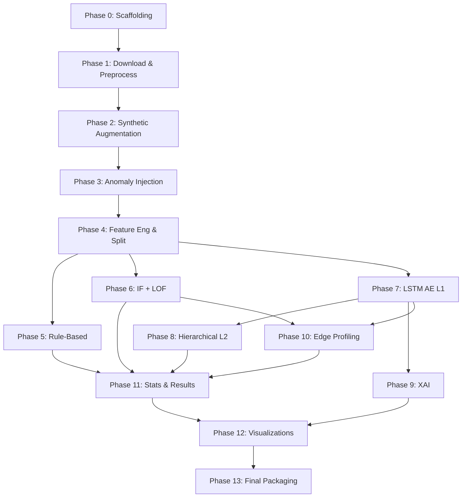

# SCIO-Bench Implementation Plan
## Anomaly Detection Benchmark for Off-Grid Solar-Battery IoT

---

## Overview

The [SCIO_Research_Framework.md](file:///\\wsl.localhost\Ubuntu\home\karel\code\SCIO-Bench\SCIO_Research_Framework.md) describes a complete research pipeline: from synthetic dataset creation to anomaly detection experiments to paper-ready outputs. This plan breaks it into **14 focused phases**, each producing a verifiable deliverable.

> [!IMPORTANT]
> All code will be written as **modular Python scripts** (not one giant notebook) under a structured project directory. A master notebook will import and orchestrate them. This ensures code quality, testability, and reusability.

---

## Architecture Decision: Modular Scripts over Monolithic Notebook

```
SCIO-Bench/
├── src/
│   ├── __init__.py
│   ├── data/
│   │   ├── __init__.py
│   │   ├── download.py          # Kaggle download & extraction
│   │   ├── preprocess.py        # Merge, resample, NaN handling
│   │   ├── augmentation.py      # SOC simulation, voltage/current derivation
│   │   ├── anomaly_injection.py # A1–A7 injection functions
│   │   └── feature_engineering.py # Rolling features, scaling, splitting
│   ├── models/
│   │   ├── __init__.py
│   │   ├── rule_based.py        # MAD-based threshold rules R1–R7
│   │   ├── isolation_forest.py  # IF with grid search
│   │   ├── lof.py               # LOF with grid search
│   │   ├── lstm_autoencoder.py  # L1 LSTM AE model
│   │   └── hierarchical_l2.py   # L2 Random Forest + SMOTE
│   ├── evaluation/
│   │   ├── __init__.py
│   │   ├── metrics.py           # F1, AUC, ADL, FPR@A6, MIR@k
│   │   ├── statistical_tests.py # McNemar's test
│   │   └── edge_profiling.py    # Inference time, RAM, model size
│   ├── xai/
│   │   ├── __init__.py
│   │   ├── shap_analysis.py     # SHAP for IF
│   │   └── reconstruction_analysis.py  # Per-feature recon error
│   └── visualization/
│       ├── __init__.py
│       └── plots.py             # All 5 figures
├── notebooks/
│   └── scio_anomaly_benchmark.ipynb  # Master orchestration notebook
├── outputs/
│   ├── dataset/
│   ├── results/
│   └── figures/
├── tests/
│   ├── test_preprocess.py
│   ├── test_augmentation.py
│   ├── test_anomaly_injection.py
│   └── test_metrics.py
├── requirements.txt
└── README.md
```

---

## Phase Breakdown

> [!TIP]
> Each phase is designed to be **completable and verifiable independently**. We move to the next phase only after the current one passes its verification.

---

### Phase 0 — Project Scaffolding
**Goal:** Set up directory structure, dependencies, and README.

#### [NEW] Directory structure (as shown above)
#### [NEW] [requirements.txt](file:///\\wsl.localhost\Ubuntu\home\karel\code\SCIO-Bench\requirements.txt)
```
python>=3.10
tensorflow>=2.15.0
scikit-learn>=1.4.0
pandas>=2.1.0
numpy>=1.26.0
matplotlib>=3.8.0
seaborn>=0.13.0
shap>=0.44.0
scipy>=1.12.0
imbalanced-learn>=0.12.0
joblib>=1.3.0
kaggle>=1.6.0
```

#### [NEW] [README.md](file:///\\wsl.localhost\Ubuntu\home\karel\code\SCIO-Bench\README.md)

**Verification:** `pip install -r requirements.txt` succeeds; all directories exist.

---

### Phase 1 — Dataset Download & Preprocessing
**Goal:** Download Kaggle data, merge, resample, clean.

#### [NEW] [download.py](file:///\\wsl.localhost\Ubuntu\home\karel\code\SCIO-Bench\src\data\download.py)
- Download via `kaggle datasets download`
- Extract to `data/raw/`

#### [NEW] [preprocess.py](file:///\\wsl.localhost\Ubuntu\home\karel\code\SCIO-Bench\src\data\preprocess.py)
- Load 4 CSVs (Plant 1 & 2 × Generation & Weather)
- Inner join on `DATE_TIME`
- Resample `15min → 30min` via `.resample('30T').mean()`
- Replace `inf` → `NaN`, forward-fill (limit=2), median-fill remainder
- Assert no NaN/Inf remain
- Rename columns to SCIO convention: `DC_POWER → mppt_w`, `MODULE_TEMPERATURE → temp_c`, etc.
- Output: `data/processed/plant1_clean.csv`, `plant2_clean.csv`

**Verification:** 
- Run `python -m pytest tests/test_preprocess.py`  
- Check: no NaN, no Inf, correct column names, ~1600 rows per plant

---

### Phase 2 — Synthetic Variable Augmentation
**Goal:** Add battery SOC, voltage, current, RSSI, protocol, and relational features.

#### [NEW] [augmentation.py](file:///\\wsl.localhost\Ubuntu\home\karel\code\SCIO-Bench\src\data\augmentation.py)
- `simulate_soc_nonlinear()` — Non-linear SOC with tapering, degradation noise (from framework §5.2)
- `derive_voltage()` — Polynomial Li-ion discharge curve + sensor noise
- `derive_current()` — `curr_a = mppt_w / volt_v`
- Add `rssi` (normal dist, μ=-70, σ=15) and `protocol` (lora/4g based on rssi)
- Compute **relational features**:
  - `ratio_power_irr = mppt_w / (irradiance + 1e-6)`
  - `ratio_volt_curr = volt_v / (curr_a + 1e-6)`
  - `physics_residual = mppt_w - volt_v * curr_a`
  - `batt_delta = batt_pct.diff()`
  - `prod_vs_batt = prod_wh - batt_delta * CAPACITY_WH / 100`
- Output: `data/processed/plant{1,2}_augmented.csv`

**Verification:**
- Run `python -m pytest tests/test_augmentation.py`
- Check: `batt_pct` range [5, 100], `volt_v` realistic range [20–28V], `physics_residual` near 0 for clean data

---

### Phase 3 — Anomaly Injection (SCIO-Bench Dataset)
**Goal:** Inject 7 anomaly types at realistic proportions, produce the final labeled dataset.

#### [NEW] [anomaly_injection.py](file:///\\wsl.localhost\Ubuntu\home\karel\code\SCIO-Bench\src\data\anomaly_injection.py)

| Anomaly | Proportion | Implementation |
|---------|-----------|---------------|
| A1: Panel Degradation | 2% | Gradual 30–50% decay over 6h windows |
| A2: Sudden Panel Drop | 1.5% | 60–80% instant drop for 1–3 ticks |
| A3: Battery Fault | 2% | Rapid SOC drop (>5%/tick) or stuck value |
| A4: Sensor Drift | 1.5% | ±15% persistent offset on volt_v/curr_a |
| A5: Device Offline | 2% | NaN / last-value-held for >3 ticks |
| A6: Low Irradiance (Normal!) | ~15% | 50–80% irradiance drop for 12–48h (NOT anomaly) |
| A7: False Data Injection | 1% | volt_v↑ 10–20%, curr_a↓ 30–50%, P unchanged |

- All injections use `np.random.seed(42)` for reproducibility
- Adds columns: `is_anomaly` (bool), `anomaly_type` (string), `is_weather_event` (bool for A6)
- Merge plant 1 & 2 into combined dataset
- Output: `outputs/dataset/scio_bench_dataset.csv` (~3200 rows)

**Verification:**
- Run `python -m pytest tests/test_anomaly_injection.py`
- Check: total anomaly rate ≈ 9% (excluding A6), A6 ≈ 15%, normal ≈ 76%
- Check: `is_anomaly` column exists and is correct bool
- Check: each anomaly type has the expected approximate count

---

### Phase 4 — Feature Engineering & Data Splitting
**Goal:** Create ML-ready features and split chronologically.

#### [NEW] [feature_engineering.py](file:///\\wsl.localhost\Ubuntu\home\karel\code\SCIO-Bench\src\data\feature_engineering.py)
- **Chronological split** (NOT random):
  - Train: day 1–20 (~1920 rows)
  - Val: day 21–25 (~480 rows)
  - Test: day 26–34 (~864 rows)
- **Rolling features**: `mean_6h`, `std_6h`, `delta_1tick` for each sensor variable
- **Weather flag**: `is_low_irradiance_period` (rolling 6h mean irradiance < 50 W/m²)
- **StandardScaler**: fit on train, transform all sets
- Output: pickled/CSV splits in `data/splits/`

**Verification:**
- Check split dates are chronological (no data leakage)
- Check scaler was fit only on train set
- Check feature count matches expected (original + rolling + relational)

---

### Phase 5 — Method A: Rule-Based Threshold
**Goal:** Implement the SCIO M1 baseline using MAD-based threshold rules.

#### [NEW] [rule_based.py](file:///\\wsl.localhost\Ubuntu\home\karel\code\SCIO-Bench\src\models\rule_based.py)
- R1: `prod_wh < 70%` of rolling 7-day median → WARNING
- R2: `batt_pct < 10%` → WARNING
- R3: `batt_pct < 5%` → CRITICAL
- R4: `temp_c > 70°C` → WARNING
- R5: offline > 3 consecutive NaN → WARNING
- R6: `volt_v` deviation > Median ± 3×MAD (rolling 24h) → WARNING
- R7: `physics_residual` > Median ± 3×MAD (rolling 6h) → WARNING [FDI detection]
- Uses `scipy.stats.median_abs_deviation` (robust vs 3-sigma)

**Verification:**
- Predict on test set → compute F1, Precision, Recall per anomaly type
- Compute FPR on A6 segments (target: FPR < 0.15)
- Save results to `outputs/results/`

---

### Phase 6 — Method B: Classical Unsupervised ML
**Goal:** Isolation Forest + LOF with grid search.

#### [NEW] [isolation_forest.py](file:///\\wsl.localhost\Ubuntu\home\karel\code\SCIO-Bench\src\models\isolation_forest.py)
- Grid search `contamination ∈ [0.02, 0.05, 0.08, 0.10]` on val set
- `n_estimators=100`, `random_state=42`
- Best model → predict on test set

#### [NEW] [lof.py](file:///\\wsl.localhost\Ubuntu\home\karel\code\SCIO-Bench\src\models\lof.py)
- Grid search `n_neighbors ∈ [10, 20, 30]` × `contamination ∈ [0.02, 0.05, 0.08, 0.10]`
- `novelty=True`, best params from val set F1

**Verification:**
- Log best params for each method
- Compute F1/Precision/Recall per anomaly type on test set
- Compare with Rule-Based baseline

---

### Phase 7 — Method C: LSTM Autoencoder (L1)
**Goal:** Build and train the semi-supervised LSTM AE.

#### [NEW] [lstm_autoencoder.py](file:///\\wsl.localhost\Ubuntu\home\karel\code\SCIO-Bench\src\models\lstm_autoencoder.py)
- Architecture: LSTM(32) → LSTM(16) → [encoded] → RepeatVector → LSTM(16) → LSTM(32) → Dense
- Train **only on normal data** (semi-supervised)
- Grid search `sequence_length ∈ [4, 6, 8]` on val set
- Threshold: `median(val_error) + 3 × MAD(val_error)`
- Epochs: 30 with early stopping (patience=5)

**Verification:**
- Training loss converges
- Reconstruction error on anomalies >> reconstruction error on normal data
- F1/AUC on test set computed and saved

---

### Phase 8 — Hierarchical L2 Classifier
**Goal:** Multi-class anomaly typing from L1 flags.

#### [NEW] [hierarchical_l2.py](file:///\\wsl.localhost\Ubuntu\home\karel\code\SCIO-Bench\src\models\hierarchical_l2.py)
- Input: samples flagged as anomaly by L1
- SMOTE oversampling (k_neighbors=3) on training anomalies
- Random Forest (n_estimators=100, class_weight='balanced')
- Alarm-budgeted evaluation: MIR@{5, 10, 20} alarms/day

**Verification:**
- L2 predicts correct anomaly types with reasonable accuracy
- MIR@10 ≤ 0.15 as target
- Event-level F1 computed

---

### Phase 9 — XAI Analysis
**Goal:** SHAP for IF + per-feature reconstruction error for LSTM AE.

#### [NEW] [shap_analysis.py](file:///\\wsl.localhost\Ubuntu\home\karel\code\SCIO-Bench\src\xai\shap_analysis.py)
- `shap.TreeExplainer(best_IF)` → SHAP values on test anomalies
- Top-3 features per anomaly type

#### [NEW] [reconstruction_analysis.py](file:///\\wsl.localhost\Ubuntu\home\karel\code\SCIO-Bench\src\xai\reconstruction_analysis.py)
- Per-feature mean reconstruction error → rank features
- Validate: A3 → batt_pct dominant; A7 → physics_residual dominant

**Verification:**
- Feature importance matches ground-truth injected variables
- SHAP summary plot generated successfully

---

### Phase 10 — Edge Hardware Profiling & TFLite
**Goal:** Benchmark inference time, RAM, model size; quantize LSTM to INT8.

#### [NEW] [edge_profiling.py](file:///\\wsl.localhost\Ubuntu\home\karel\code\SCIO-Bench\src\evaluation\edge_profiling.py)
- `timeit` × 1000 runs per method for single-sample inference
- `tracemalloc` for peak RAM
- `joblib.dump` size for IF/LOF; `.h5` for LSTM AE
- TFLite INT8 quantization → compare F1 delta (<1% expected)
- ESP32/RPi4 feasibility assessment

**Verification:**
- Edge deployment table completed with all metrics
- TFLite model created and inference verified
- F1 degradation from quantization < 1%

---

### Phase 11 — Statistical Tests & Results Compilation
**Goal:** McNemar's test + compile all result tables.

#### [NEW] [statistical_tests.py](file:///\\wsl.localhost\Ubuntu\home\karel\code\SCIO-Bench\src\evaluation\statistical_tests.py)
- McNemar: Rule-Based vs Best ML, Best ML vs LSTM AE
- p < 0.05 = significantly different

#### Results tables:
- Table I: F1 per anomaly type per method
- Table II: AUC, ADL, Inference Time, FPR@A6
- Table III: Best hyperparameters from grid search

**Verification:**
- CSV and LaTeX formatted tables exported
- All cells filled with actual experimental results

---

### Phase 12 — Visualizations
**Goal:** 5 publication-quality figures.

#### [NEW] [plots.py](file:///\\wsl.localhost\Ubuntu\home\karel\code\SCIO-Bench\src\visualization\plots.py)
- Figure 1: ROC curves (all methods overlaid)
- Figure 2: 24h time-series with anomaly + detection highlights
- Figure 3: Grouped bar chart F1 per anomaly type
- Figure 4: SHAP summary plot (Isolation Forest)
- Figure 5: LSTM AE per-feature reconstruction error heatmap

**Verification:**
- All figures saved as PDF, 300 DPI
- Visual inspection: legends, labels, readable

---

### Phase 13 — Final Packaging
**Goal:** Export everything for publication/reproducibility.

- `outputs/dataset/scio_bench_dataset.csv` (for Zenodo upload)
- `notebooks/scio_anomaly_benchmark.ipynb` (master notebook)
- `requirements.txt` finalized with exact versions
- `README.md` with < 5-step setup instructions

**Verification:**
- Fresh clone → `pip install -r requirements.txt` → run notebook → all outputs regenerated

---

## Execution Order Summary



> [!NOTE]
> Phases 5, 6, 7 can run in parallel after Phase 4 is done. But for code quality focus, I recommend completing them sequentially: **5 → 6 → 7 → 8 → 9 → 10** so each builds on lessons from the previous.

---

## Verification Plan

### Automated Tests
Each data pipeline phase has a dedicated test file in `tests/`:
```bash
# Run all tests
python -m pytest tests/ -v

# Run specific phase tests
python -m pytest tests/test_preprocess.py -v      # Phase 1
python -m pytest tests/test_augmentation.py -v     # Phase 2
python -m pytest tests/test_anomaly_injection.py -v # Phase 3
python -m pytest tests/test_metrics.py -v          # Phase 5–8
```

### Manual Verification
After each phase completes, verify:
1. **Phase 3:** Open `scio_bench_dataset.csv` → check `value_counts('anomaly_type')` matches expected proportions
2. **Phase 5–7:** Review F1 scores — if any method F1 < 0.5, document as finding (don't manipulate)
3. **Phase 12:** Visually inspect all 5 figures for readability and correctness

> [!CAUTION]
> The **Kaggle dataset must be downloaded manually** (requires API key). If the user doesn't have `kaggle.json`, we'll need to handle this in Phase 1.
